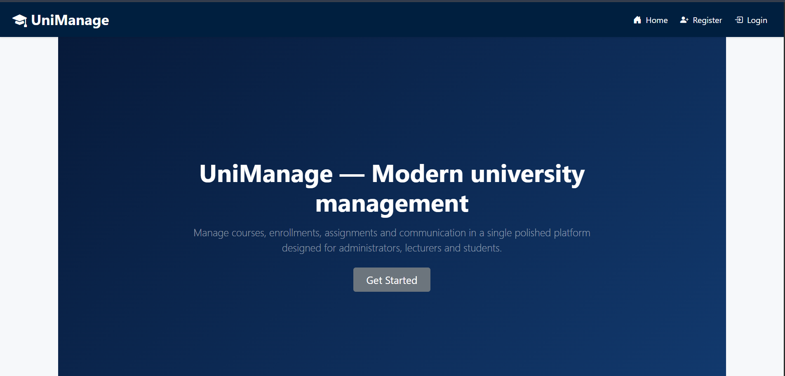
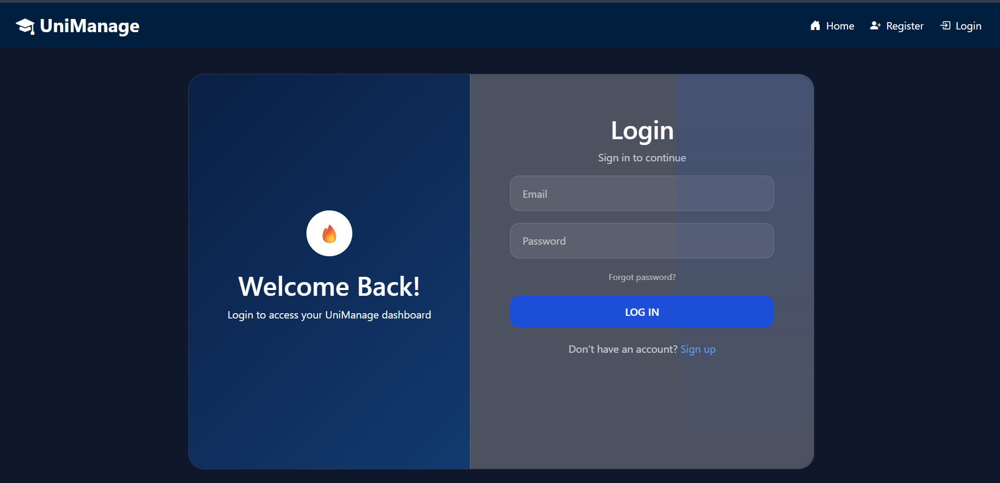
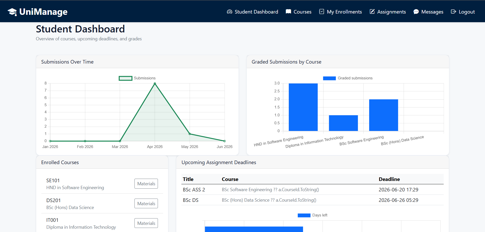
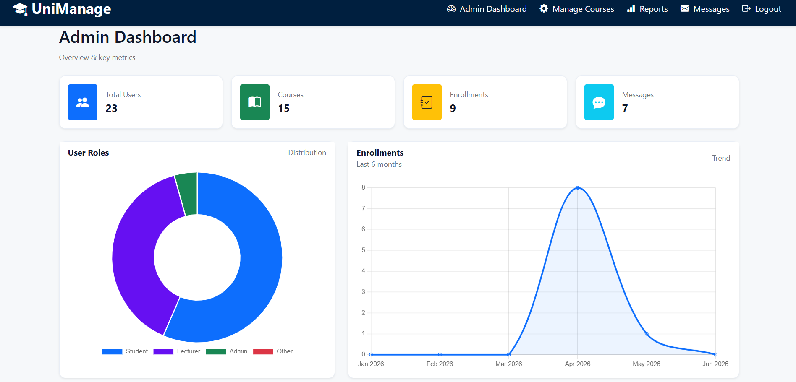
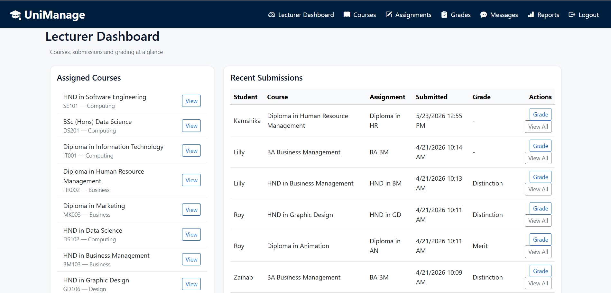
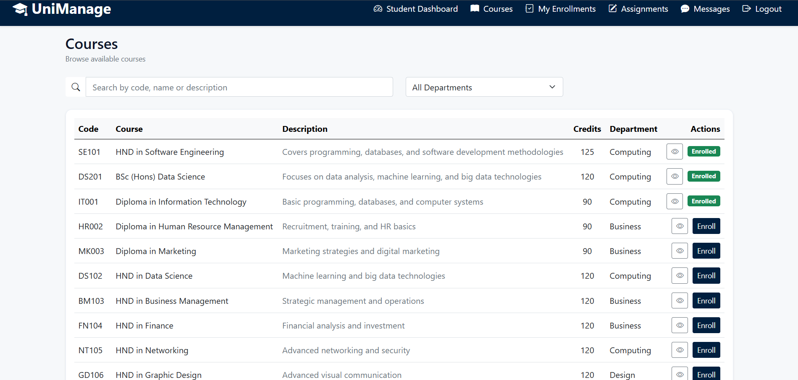
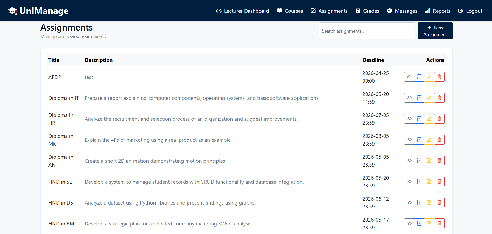
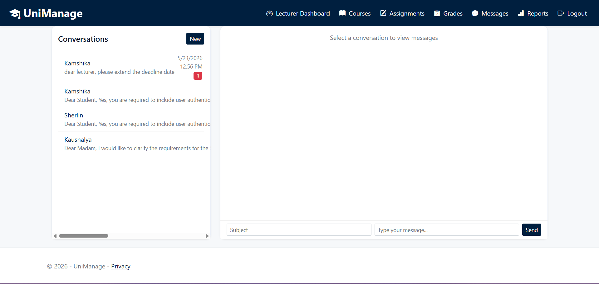

# 🎓 UniManage – University Course Management System (ASP.NET MVC)

UniManage is a full-featured **web-based university management system** developed using **ASP.NET MVC, C#, and SQL Server**.  
It is designed to digitalize and streamline academic and administrative operations in a university environment.

The system supports **students, lecturers, and administrators**, each with role-based access to ensure security and proper data handling.

---

## 🚀 Key Features

### 👨‍🎓 Student Features
- Student registration and secure login
- View and enroll in courses
- Access course materials
- Submit assignments (file/text upload)
- View grades and lecturer feedback
- Messaging with lecturers
- Track deadlines and submissions

### 🧑‍🏫 Lecturer Features
- Manage assigned courses
- Create and manage assignments
- Upload course materials
- View and grade student submissions
- Provide feedback to students
- Messaging system with students
- View performance analytics

### 🧑‍💼 Admin Features
- Manage users (students, lecturers, admins)
- Create, update, and delete courses
- Manage enrollments
- System-wide reporting and analytics
- View platform usage statistics
- Monitor messaging and system activity

---

## 🏗️ System Architecture

- ASP.NET MVC (Model–View–Controller)
- Entity Framework Core (ORM)
- SQL Server Database
- Razor Views (Frontend rendering)
- Role-Based Authentication System
- Session-based login management

---

## 💻 Technologies Used

- ASP.NET MVC
- C# (.NET Framework / .NET Core)
- SQL Server
- Entity Framework
- HTML5, CSS3, JavaScript
- Bootstrap
- Visual Studio

---

## 📂 Project Structure

UniManage/
│
├── Controllers/ # Application logic (MVC Controllers)
├── Models/ # Data models
├── Views/ # UI (Razor Pages)
├── Data/ # DbContext and database configuration
├── Migrations/ # EF Core migrations
├── wwwroot/ # Static files (CSS, JS, images)
├── appsettings.json # Database connection settings
├── Program.cs # Application startup
├── UniManage.csproj # Project file

---

## 🔐 Security Features

- Role-based access control (Student / Lecturer / Admin)
- Secure login and authentication
- Input validation for forms
- Session-based user management
- Protection against unauthorized access

---

## 📊 Core Modules

- User Management System
- Course Management System
- Enrollment System
- Assignment & Submission System
- Grading System
- Messaging System
- Reporting & Analytics Dashboard

---

## ⚙️ Installation Guide
Open project in Visual Studio 2022 (UniManage.sln)
Restore NuGet packages (automatic or run dotnet restore)
Update connection string in appsettings.json
Run database migration:
dotnet ef database update
Run the project using F5 (IIS Express)

---

## 🖼 Screenshots

### 🏠 Home Page

### 🔐 Login Page

### 👨‍🎓 Student Dashboard

### 🧑‍💼 Admin Dashboard

### 🧑‍🏫 Lecturer Dashboard

### 📚 Course Page

### 📝 Assignment Page

### 💬 Messaging System

---

📈 Future Improvements
AI-based course recommendation system
Email notifications for deadlines
Mobile application version
Advanced analytics dashboard
API integration for external systems

---

📜 License

This project is developed for academic and learning purposes only.
